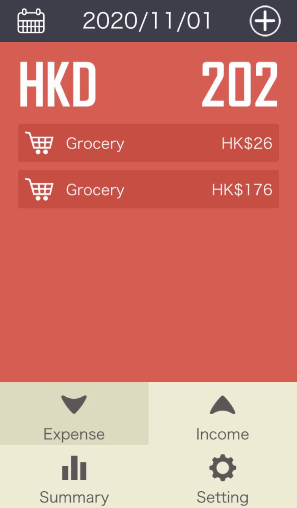
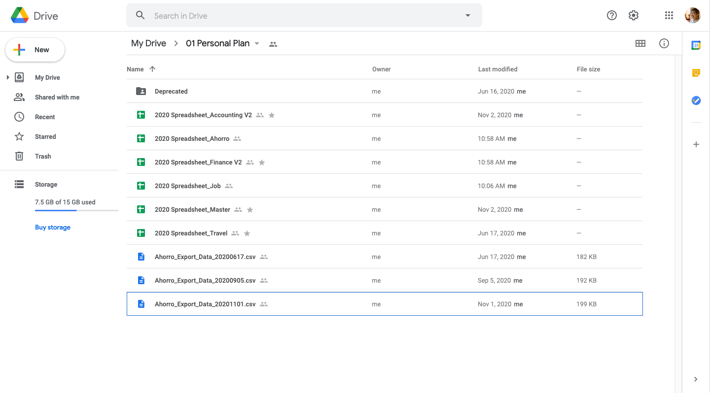
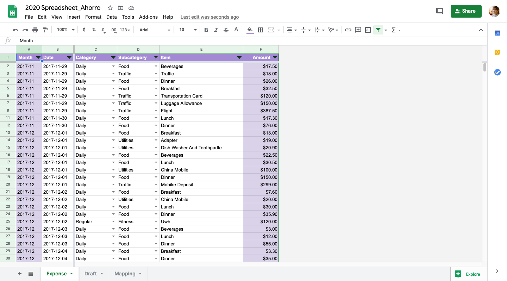
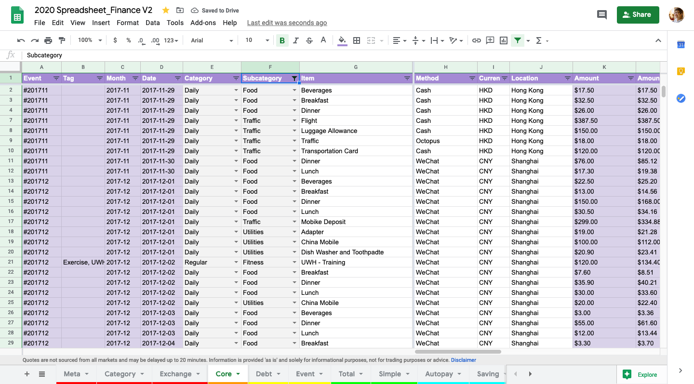

# Monthly-Expense-Data-Pipeline

Use Python to transform data from expense tracker app (Ahorro) and export to Google Spreadsheet for analysis

See [Google Colaboratory](https://colab.research.google.com/drive/1uTV201tudYP3KXDttrVvoTMDEMMljvTK) for source  code

### Step 1: Record expense on Ahorro app every day

  

### Step 2: Extract data as csv, email the file and save in Google Drive

  

### Step 3: Use Python to transform data and export to Google Spreadsheet

    

### Step 4: Perform further data clean-up and analysis manually

    

